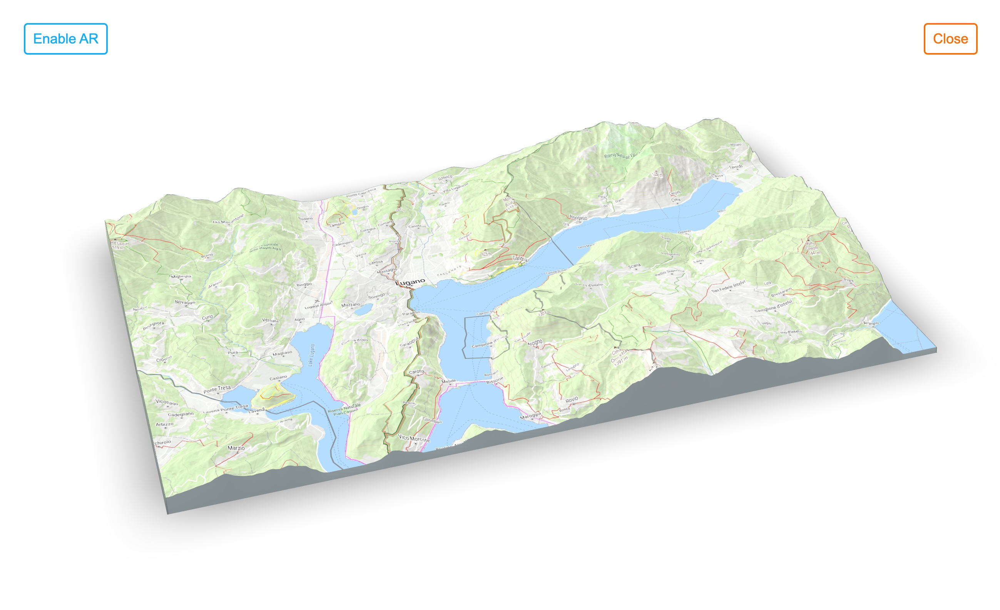
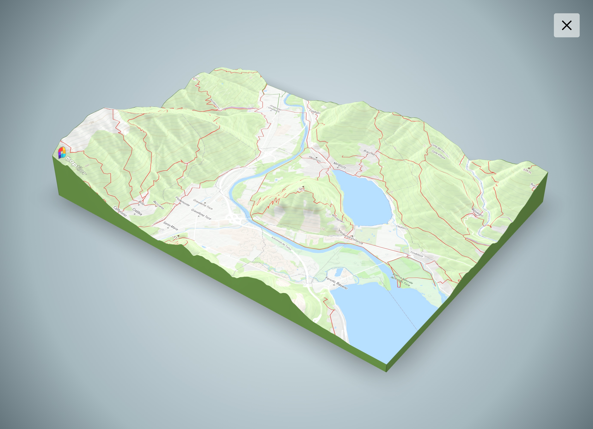

# AR Control for MapTiler SDK JS

This AR control adds a button on your [MapTiler SDK's](https://docs.maptiler.com/sdk-js/) Map to create a 3D model of the viewport, including 3D terrain and any layer you have put on top.  
If your device is compatible with **WebXR** or **Apple Quick Look**, the **Enable AR** button will show up. Then you can position and interact with the 3D model on your own space!

[](https://www.npmjs.com/package/@maptiler/ar-control) 

---

📖 [Documentation](https://docs.maptiler.com/sdk-js/modules/ar/) &nbsp; 📦 [NPM Package](https://www.npmjs.com/package/@maptiler/ar-control) &nbsp; 🌐 [Website](https://www.maptiler.com/ar/) &nbsp; 🔑 [Get API Key](https://cloud.maptiler.com/account/keys/)

---

<br>

<details> <summary><b>Table of Contents</b></summary>
<ul>
<li><a href="#-installation">Installation</a></li>
<li><a href="#-basic-usage">Basic Usage</a></li>
<li><a href="#-related-examples">Examples</a></li>
<li><a href="#-api-reference">API Reference</a></li>
<li><a href="#-support">Support</a></li>
<li><a href="#-contributing">Contributing</a></li>
<li><a href="#-license">License</a></li>
<li><a href="#-acknowledgements">Acknowledgements</a></li>
</ul>
</details>

<p align="center">     <br />  <a href="https://docs.maptiler.com/sdk-js/examples/ar-control/">See live interactive demo</a> </p>
<br>

## 📦 Installation

### ES module from NPM
```bash
npm install @maptiler/sdk @maptiler/ar-control
```

Then in your code, import the control:
```js
// Import MapTiler SDK
import * as maptilersdk from "@maptiler/sdk";

// Import the AR Control
import * as maptilerarcontrol from "@maptiler/ar-control";
// Or specifically:
import { MaptilerARControl } from "@maptiler/ar-control";
```

⚠️ with **NextJS**, the AR control module must be dynamically imported:
```js
const maptilerarcontrol = await import("@maptiler/ar-control");
```
This must be done in  hook that is only executed client side (or inside `componentDidMount`, in the case of class components). This is due to the AR Control dependency to ModelViewer that needs to acces the global object `window`. NextJS will attempt SSR, where `window` is not defined and this will result in an error.

### Vanilla JS from CDN (UMD bundles)
```html
<!-- Make sure you enable device pixel ratio greater than 1 -->
<meta name="viewport" content="width=device-width, initial-scale=1">

<!-- Import MapTiler SDK -->
<script src="https://cdn.maptiler.com/maptiler-sdk-js/latest/maptiler-sdk.umd.min.js"></script>
<link href="https://cdn.maptiler.com/maptiler-sdk-js/latest/maptiler-sdk.css" rel="stylesheet" />

<!-- Import the AR Control -->
<script src="https://cdn.maptiler.com/maptiler-ar-control/latest/maptiler-ar-control.umd.js"></script>
```

<br>

## 🚀 Basic Usage

The AR control requires to be used with the [MapTiler SDK JS](https://docs.maptiler.com/sdk-js/).   

```js
maptilersdk.config.apiKey = 'YOUR_MAPTILER_CLOUD_TOKEN';

// Creating a map
const map = new maptilersdk.Map({
  container: 'map',
  style: maptilersdk.MapStyle.OUTDOOR,
  terrain: true,
  hash: true,
  geolocate: true,
});

// Waiting for the map to be ready
map.on("load", (e) => {
  // Creating the control
  const arControl = new maptilerarcontrol.MaptilerARControl();
  
  // Adding the AR control on the top-left corner of the map
  map.addControl(arControl, "top-left");

  arControl.on("computeStart", (e) => {
    // Do something when the control starts to compute the 3D model 
  })

  arControl.on("computeEnd", (e) => {
    // Do something when the control is done computing the 3D model 
  })
})
```

<br>

## 💡 Related Examples

- [Getting started with AR maps: Display an AR control on your maps](https://docs.maptiler.com/sdk-js/examples/ar-control/)
- [Add GeoJSON to AR maps](https://docs.maptiler.com/sdk-js/examples/ar-control-geojson-line/)
- [Include a QR code to access your augmented reality (AR) maps on a mobile device](https://docs.maptiler.com/sdk-js/examples/ar-control-qr/)

Check out the full list of [MapTiler examples](https://docs.maptiler.com/sdk-js/examples/?q=%28ar%29)

<br>

## 📘 API Reference

For detailed guides, API reference, and advanced examples, visit our comprehensive documentation:

[API documentation](https://docs.maptiler.com/sdk-js/modules/ar/api/api-reference/)

### Events

There are two events:
- `computeStart` happens when the AR control starts computing the the 3D model, as soon as the `AR` button is clicked.
- `computeEnd` happens when the AR control is done computing the model and is about to display it

The AR control performs some temporary changes to the map view, so these events are handy to hide those transformations behind a curtain or displaying a message.

In the [example](./examples/index.html), we show a fullscreen overlay with a waiting message at `computeStart` and hides it at `computeEnd`, just by dynamically updating the `.style.display` property of the overlay. Keep in mind that the `z-index` CSS property of this overlay must be higher than the 3D model view, so greater than `3`.    
When using React, you may want to replace this logic by a change of state.

### Options

The constructor `MaptilerARControl` accepts an option object to customize the look and feel. Here are the attributes:
- `showButton` (boolean): Shows the AR button if `true`, hide it otherwise. Default: `true`.
- `background` (string): Background color (or any css-compatible string for gradient or image url). Default: `"#FFFFFF"` (white).
- `closeButtonClassName` (string): CSS class to add to the close button on the AR modal. If none is provided, a default inline style is added Default: none.
- `closeButtonContent` (string | HTMLElement): Content to add to the close button. If the content is a string, it is added as `.innerHTML`. If it's a DOM element, it is added as `.appendChild()`. Default: `"Close"`.
- `arButtonClassName` (string): CSS class to add to the AR button on the AR modal. If none is provided, a default inline style is added. Default: none
- `arButtonContent` (string | HTMLElement): Content to add to the AR button. If the content is a string, it is added as `.innerHTML`. If it's a DOM element, it is added as `.appendChild()`. Default: `"Close"`.
- `edgeColor` (string): Color of the 3D model edges. Default: `"#0eaeff"` (grayish teal)
- `logo` (string): a URL to a logo placed at the bottom of the 3D view when AR mode is not enabled. By default, the logo will have an height of 60 pixel and be placed at the bottom left corner with a margin of 10 pixels.
- `logoHeight`(number): the height of the logo in pixels (if any). Default: `60`
- `logoClass` (string): CSS class to add to the class list of the `` element holding the logo (if any). If used, the `.logoHeight` as well as the default styling will no longer be applied.
- `activateAR` (boolean): When the platform allows, setting this to `true` automatically activates the AR mode as soon as the data is ready. Quick Look on iOS is likely to allow this, while WebXR on Android is not likeley to. Default: `false`
- `highRes` (boolean): increases the resolution of the texture. Will most likely have no effect on iOS due to some format limitation. Default: `false`.



### Methods

- `.run()`: programmatically run the computation of the 3D model. This can be used in replacement of a click on the control
- `.close()`: programmatically closes the overlay containing the 3D model
- `.updateLogo(src: string)`: updates the `src` of the logo. This can only be used if the `.logo` option was set in the constructor. Can be coupled with the `computeStart` event to refresh the information, for isntance a dynamically generated QR code that would contain info about the place being processed.

### Capacitor integration (iOS)

MapTiler SDK can be used efficiently with [CapacitorJS](https://capacitorjs.com/) to create beautiful native maps-centric apps. This AR Control has been design to work in such scenario, though a different scenrio is unrolled internaly: there will be no intermediate 3D model and instead Apple Quicklook will directly open.

Your mobile app (or at least the compinent that installed on the mobile device) needs to have these Capacitor dependencies installed:

``` shell
npm install @capacitor/core @capacitor/filesystem @capacitor-community/file-opener
```

<br>

## 💬 Support

- 📚 [Documentation](https://docs.maptiler.com/sdk-js/modules/ar/) - Comprehensive guides and API reference
- ✉️ [Contact us](https://maptiler.com/contact) - Get in touch or submit a request
- 🐦 [Twitter/X](https://twitter.com/maptiler) - Follow us for updates

<br>

---

<br>

## 🤝 Contributing

We love contributions from the community! Whether it's bug reports, feature requests, or pull requests, all contributions are welcome:

- Fork the repository and create your branch from `main`
- If you've added code, add tests that cover your changes
- Ensure your code follows our style guidelines
- Give your pull request a clear, descriptive summary
- Open a Pull Request with a comprehensive description

<br>

## 📄 License

This project is licensed under the MapTiler JS Module – see the [LICENSE](./LICENSE.md) file for details.

<br>

## 🙏 Acknowledgements

This project is built on the shoulders of giants:

- [MapTiler SDK JS](https://docs.maptiler.com/sdk-js/) – The open-source mapping library
- [three.js](https://threejs.org/) – JavaScript 3D Library

<br>

<p align="center" style="margin-top:20px;margin-bottom:20px;"> <a href="https://cloud.maptiler.com/account/keys/" style="display:inline-block;padding:12px 32px;background:#F2F6FF;color:#000;font-weight:bold;border-radius:6px;text-decoration:none;"> Get Your API Key <sup style="background-color:#0000ff;color:#fff;padding:2px 6px;font-size:12px;border-radius:3px;">FREE</sup><br /> <span style="font-size:90%;font-weight:400;">Start building with 100,000 free map loads per month ・ No credit card required.</span> </a> </p>

<br>

<p align="center"> 💜 Made with love by the <a href="https://www.maptiler.com/">MapTiler</a> team <br />
<p align="center">
  <a href="https://www.maptiler.com/ar/">Website</a> •
  <a href="https://docs.maptiler.com/sdk-js/modules/ar/">Documentation</a> •
  <a href="https://github.com/maptiler/maptiler-ar-control/">GitHub</a>
</p>