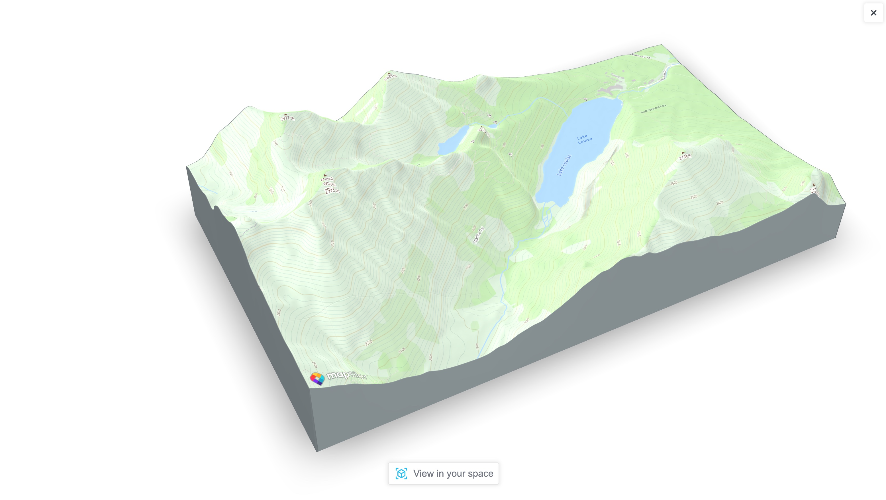

<p align="center">
  <a href="https://docs.maptiler.com/sdk-js/">official page →</a><br>
  
</p>

<p align="center" style="color: #AAA">
  AR Control for <a href="https://docs.maptiler.com/sdk-js/">MapTiler SDK JS</a>
</p>

<p align="center">
  
  
  </img>
  </img>
</p>

This AR control adds a button on your MapTiler SDK's Map to create a 3D model of the viewport, including 3D terrain and any layer you have put on top.  
If your device is compatible with **WebXR** or **Apple Quick Look**, the **Enable AR** button will show up. Then you can position and interact with the 3D model on your own space!


# Install
## ES module from NPM
```bash
npm install @maptiler/sdk @maptiler/ar-control
```

Then in your code, import the control:
```js
// Import MapTiler SDK
import maptilersdk from "@maptiler/sdk";

// Import the AR Control
import maptilerarcontrol from "@maptiler/ar-control";
```

⚠️ with **NextJS**, the AR control module must be dynamically imported:
```js
const maptilerarcontrol = await import("@maptiler/ar-control");
```
This must be done in  hook that is only executed client side (or inside `componentDidMount`, in the case of class components). This is due to the AR Control dependency to ModelViewer that needs to acces the global object `window`. NextJS will attempt SSR, where `window` is not defined and this will result in an error.

# Vanilla JS from CDN (UMD bundles)
```html
<!-- Make sure you enable device pixel ratio greater than 1 -->
<meta name="viewport" content="width=device-width, initial-scale=1">

<!-- Import MapTiler SDK -->
<script src="https://cdn.maptiler.com/maptiler-sdk-js/latest/maptiler-sdk.umd.min.js"></script>
<link href="https://cdn.maptiler.com/maptiler-sdk-js/latest/maptiler-sdk.css" rel="stylesheet" />

<!-- Import the AR Control -->
<script src="https://cdn.maptiler.com/maptiler-ar-control/latest/maptiler-ar-control.umd.js"></script>
```

# Setup
The AR control requires to be used with our SDK (which is an extension of MapLibre).   

```js
// Get a free token at https://cloud.maptiler.com
// with a generous free tier!
maptilersdk.config.apiKey = 'YOUR_MAPTILER_CLOUD_TOKEN';

// Creating a map
const map = new maptilersdk.Map({
  container: 'map',
  style: maptilersdk.MapStyle.OUTDOOR,
  terrain: true,
  hash: true,
  geolocate: true,
});

// Waiting for the map to be ready
map.on("load", (e) => {
  // Creating the control
  const arControl = new maptilerarcontrol.MaptilerARControl();
  
  // Adding the AR control on the top-left corner of the map
  map.addControl(arControl, "top-left");

  arControl.on("computeStart", (e) => {
    // Do something when the control starts to compute the 3D model 
  })

  arControl.on("computeEnd", (e) => {
    // Do something when the control is done computing the 3D model 
  })
})
```

# Events
There are two events:
- `computeStart` happens when the AR control starts computing the the 3D model, as soon as the `AR` button is clicked.
- `computeEnd` happens when the AR control is done computing the model and is about to display it

The AR control performs some temporary changes to the map view, so these events are handy to hide those transformations behind a curtain or displaying a message.

In the [example](./examples/index.html), we show a fullscreen overlay with a waiting message at `computeStart` and hides it at `computeEnd`, just by dynamically updating the `.style.display` property of the overlay. Keep in mind that the `z-index` CSS property of this overlay must be higher than the 3D model view, so greater than `3`.    
When using React, you may want to replace this logic by a change of state.

# Options
The constructor `MaptilerARControl` accepts an option object to customize the look and feel. Here are the attributes:
- `showButton` (boolean): Shows the AR button if `true`, hide it otherwise. Default: `true`.
- `background` (string): Background color (or any css-compatible string for gradient or image url). Default: `"#FFFFFF"` (white).
- `closeButtonClassName` (string): CSS class to add to the close button on the AR modal. If none is provided, a default inline style is added Default: none.
- `closeButtonContent` (string | HTMLElement): Content to add to the close button. If the content is a string, it is added as `.innerHTML`. If it's a DOM element, it is added as `.appendChild()`. Default: `"Close"`.
- `arButtonClassName` (string): CSS class to add to the AR button on the AR modal. If none is provided, a default inline style is added. Default: none
- `arButtonContent` (string | HTMLElement): Content to add to the AR button. If the content is a string, it is added as `.innerHTML`. If it's a DOM element, it is added as `.appendChild()`. Default: `"Close"`.
- `edgeColor` (string): Color of the 3D model edges. Default: `"#0eaeff"` (grayish teal)
- `logo` (string): a URL to a logo placed at the bottom of the 3D view when AR mode is not enabled. By default, the logo will have an height of 60 pixel and be placed at the bottom left corner with a margin of 10 pixels.
- `logoHeight`(number): the height of the logo in pixels (if any). Default: `60`
- `logoClass` (string): CSS class to add to the class list of the `` element holding the logo (if any). If used, the `.logoHeight` as well as the default styling will no longer be applied.
- `activateAR` (boolean): When the platform allows, setting this to `true` automatically activates the AR mode as soon as the data is ready. Quick Look on iOS is likely to allow this, while WebXR on Android is not likeley to. Default: `false`


# Methods

- `.run()`: programmatically run the computation of the 3D model. This can be used in replacement of a click on the control
- `.close()`: programmatically closes the overlay containing the 3D model
- `.updateLogo(src: string)`: updates the `src` of the logo. This can only be used if the `.logo` option was set in the constructor. Can be coupled with the `computeStart` event to refresh the information, for isntance a dynamically generated QR code that would contain info about the place being processed.

# License
MapTiler AR Control

Copyright © 2023 MapTiler AG. All rights reserved.

The software and files (collectively “Software”) in this repository are licensed for use only with MapTiler service(s). 

For the license terms, please reference  [MapTiler General Terms and Conditions](https://www.maptiler.com/terms/) which incorporate MapTiler AR Control Product [Terms (collectively “Terms”) and Privacy Policy at Privacy policy](https://www.maptiler.com/privacy-policy). 

This license allows users with an active MapTiler account to modify and integrate authorized portions of the Software for use with the relevant MapTiler service(s) in accordance with the MapTiler Terms. This license terminates automatically if a user no longer maintains a MapTiler account or their usage breaches MapTiler Terms. 